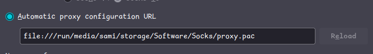

<p align="center">
  
</p>

# PAC

## A Proxy Auto-Config file (or **PAC** for short) is a modern standard adopted by most modern web browsers to automate proxy selection using JavaScript

## This guide will explain how to create a custom PAC file to bypass restricted sites using a SOCKS5 proxy set up in the [predecessor guide](https://github.com/OSA-Socks/Docker)

## 1. Creating the file
Firstly, Choose a safe and memorable folder to store your PAC file, so you don’t accidentally lose it.

Once you have decided on a directly, create a file. The file name and extension don't technically matter, but you may want to use `.pac` to remember the file purpose.

PAC files are quite unique, in that they implement a few unique functions and APIs specific to proxy configuration.

As a good baseline, you can use the following code:

```js
function FindProxyForURL(url, host) {
  var whitelist = [
    "*.reddit.com",
    "bsky.app"
  ];

  for (var i = 0; i < whitelist.length; i++) {
    if (shExpMatch(host, whitelist[i])) {
      return "SOCKS5 127.0.0.1:1080";
    }
  }

  return "DIRECT";
}
```

If you're familiar with any form of programming, you'll find this code very simple.

There's not much logic to explain, but it's important to draw attention to the use of wildcards.

Two sites are proxied in the example, `reddit.com` and `bsky.app` (both restricted by the OSA).

Noticeably, Reddit is matched with a subdomain wildcard, while Bluesky isn't.

This is because if you navigate in your browser to Reddit and Bluesky respectively, Reddit uses the `www` subdomain, while Bluesky doesn't.

It's important to include subdomain wildcards on sites that require them, otherwise they won't be matched.

## 2. Configuring Your Browser

### On Firefox
Automatic proxy settings are located in the "Network Settings" section, which you can search to find.

Change the proxy option to the following:


Naturally, you should adjust the value to match both your operating system's path schema and the location of your PAC file.

For the proxy changes to apply, you may need to:
- Re-open Firefox

or

- Navigate to `about:networking` and clear both the HTTP and DNS cache.

### On Chromium